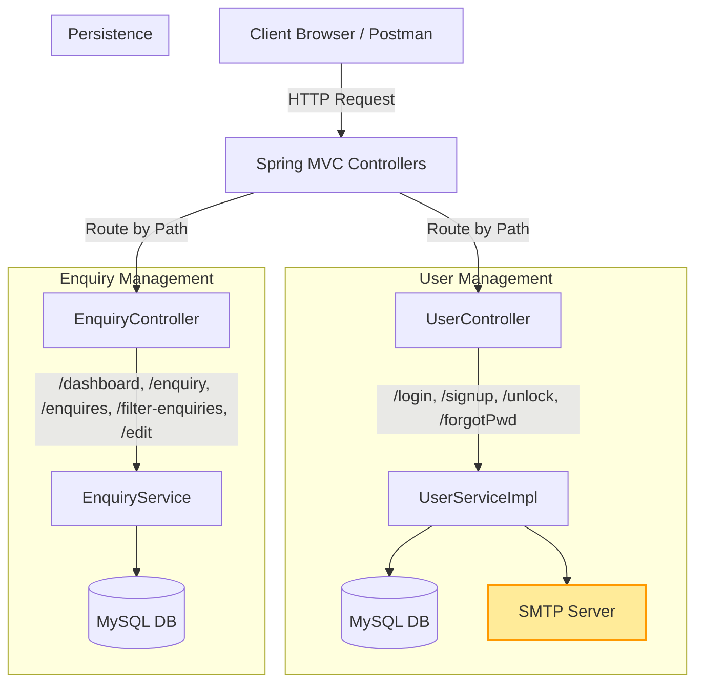

# 🎯 Student Enquiry & User Management System

A **Spring Boot MVC application** for managing user authentication, unlocking accounts, password recovery, and student enquiry tracking.  
Built with **Spring Boot, Spring MVC, Thymeleaf, JPA, MySQL**, and **Session-based authentication**.

---

## 🚀 Features

### 👤 **User Management**
- **User Registration** with unique email validation
- **Account Unlock** using temporary password sent via email
- **Login** with session management
- **Forgot Password** feature to send password via email
- **Secure password storage** with hashing (BCrypt recommended)

### 📞 **Student Enquiry Management**
- **Add new enquiries** with course and status dropdowns
- **View all enquiries**
- **Filter enquiries** by:
  - Course name
  - Class mode
  - Enquiry status
- **Edit existing enquiries**
- **Dashboard** showing total, open, enrolled, and lost enquiries

### 🔐 **Security**
- Session-based authentication
- Email-based account verification
- Error and success message handling
- Form validation before submission

---

## 🏗 **Architecture**



---

## 📂 **Project Structure**
```
src/main/java/in/ashokit
│
├── controller
│   ├── UserController.java
│   ├── EnquiryController.java
│
├── binding
│   ├── LoginForm.java
│   ├── SignUpForm.java
│   ├── UnlockForm.java
│   ├── EnquiryForm.java
│   ├── EnquirySearchCriteria.java
│   └── DashboardForm.java
│
├── entity
│   └── StudentEnqEntity.java
│
├── repo
│   └── StudentEnqRepository.java
│
└── service
    ├── UserServiceImpl.java
    ├── EnquiryService.java
    └── impl...
```

---

## ⚙ **Setup Instructions**

### 1️⃣ Prerequisites
- **Java 17+**
- **Maven**
- **MySQL Database**
- **SMTP email credentials** for sending account unlock and password reset emails

### 2️⃣ Clone Repository
```bash
git clone https://github.com/your-repo/student-enquiry-system.git
cd student-enquiry-system
```

### 3️⃣ Configure Database & Email
Edit `application.properties`:
```properties
spring.datasource.url=jdbc:mysql://localhost:3306/studentdb
spring.datasource.username=root
spring.datasource.password=yourpassword

spring.mail.host=smtp.gmail.com
spring.mail.port=587
spring.mail.username=youremail@gmail.com
spring.mail.password=yourapppassword
spring.mail.properties.mail.smtp.auth=true
spring.mail.properties.mail.smtp.starttls.enable=true
```

### 4️⃣ Run Application
```bash
mvn spring-boot:run
```

---

## 📌 **API Endpoints**

### 🔑 User Management
| Method | Endpoint       | Description |
|--------|---------------|-------------|
| GET    | `/login`      | Login page |
| POST   | `/login`      | Authenticate user |
| GET    | `/signup`     | Registration page |
| POST   | `/signup`     | Create new account |
| GET    | `/unlock`     | Unlock account form |
| POST   | `/unlock`     | Unlock user account |
| GET    | `/forgot`     | Forgot password page |
| POST   | `/forgotPwd`  | Send password to email |

### 📚 Enquiry Management
| Method | Endpoint             | Description |
|--------|---------------------|-------------|
| GET    | `/dashboard`        | Show dashboard data |
| GET    | `/enquiry`          | Add enquiry form |
| POST   | `/addEnq`           | Save enquiry |
| GET    | `/enquires`         | View all enquiries |
| GET    | `/filter-enquiries` | Filter enquiries |
| GET    | `/edit`             | Edit enquiry by ID |
| GET    | `/logout`           | Logout user |

---

## 📊 Dashboard Example
- **Total Enquiries:** 50  
- **Open:** 20  
- **Enrolled:** 25  
- **Lost:** 5  

---

## 📜 License
This project is licensed under the GMK.

---
💡 *You can extend this system by adding role-based security, JWT authentication, and REST API support.*
